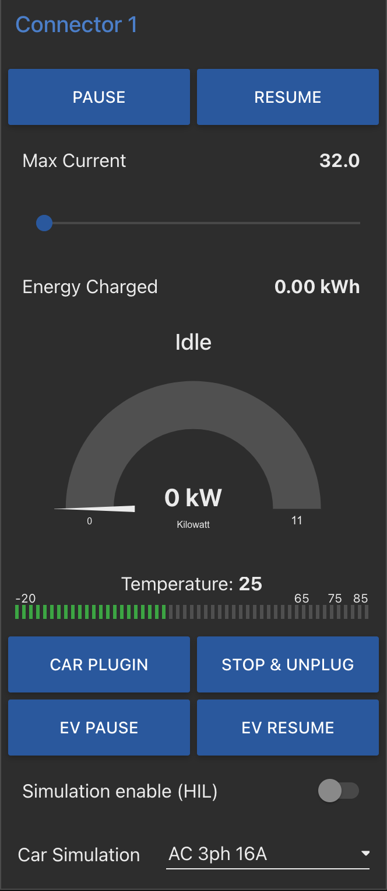
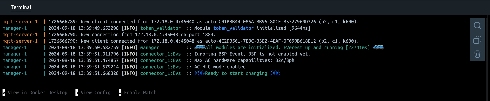
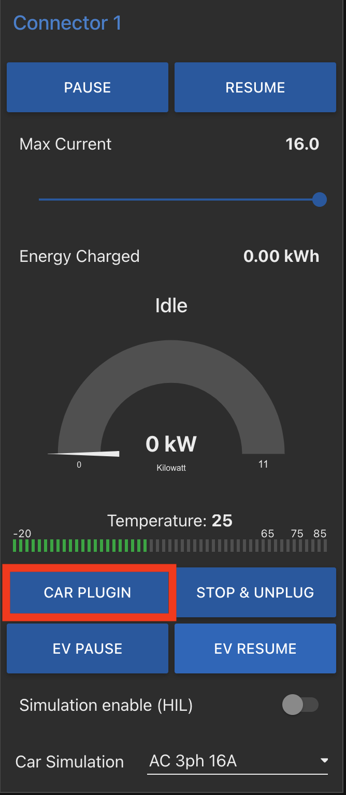
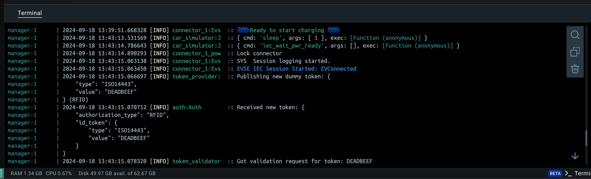
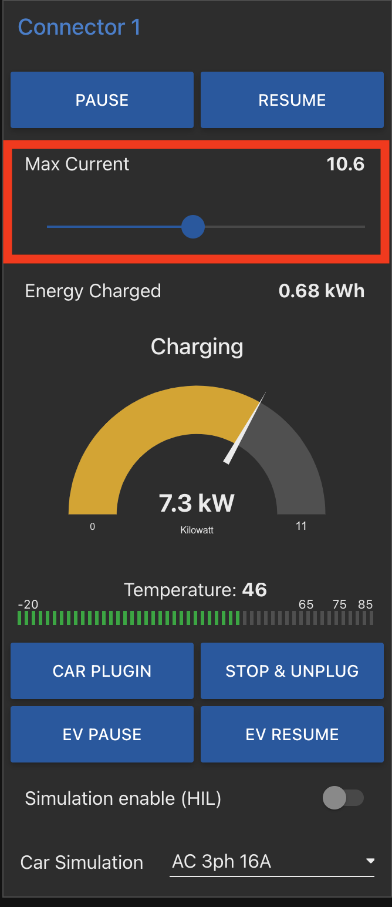
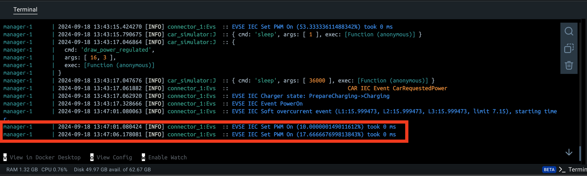
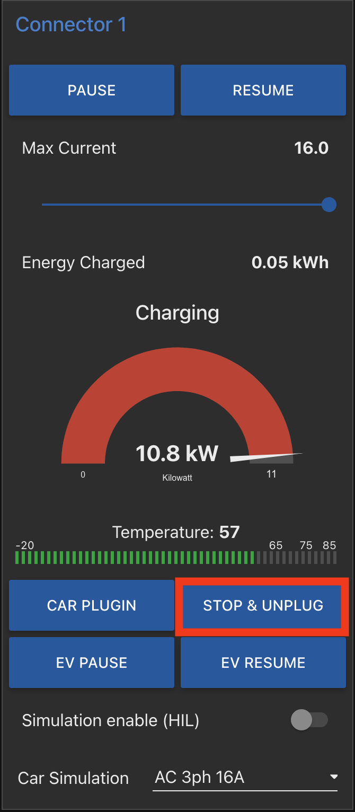
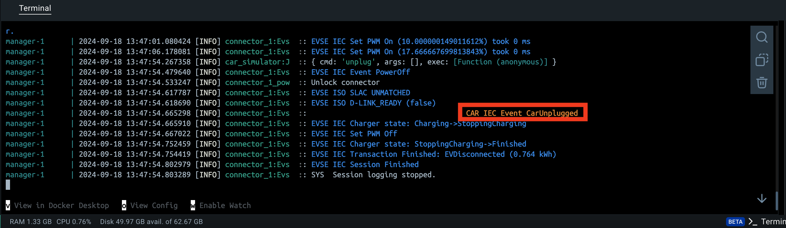
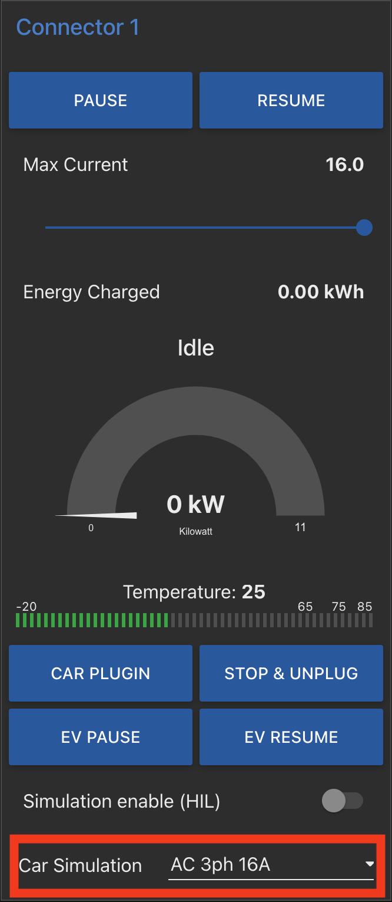
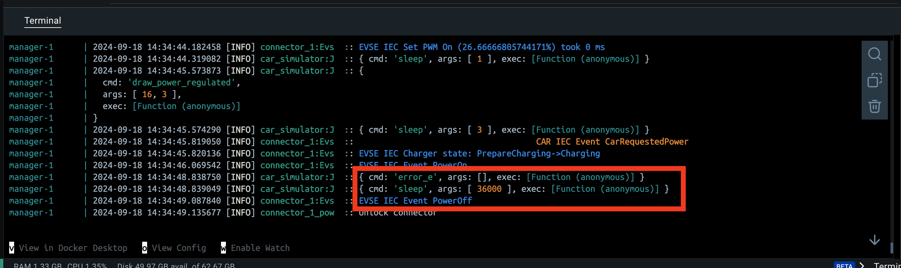

# Vision 

This repository includes several demos of the [EVerest](https://lfenergy.org/projects/everest/) tech stack capabilities which aim to exemplify the modular nature of EVerest. The intent of this repository is to showcase the foundational layers of a charging solution that could address interoperability and reliability issues in the EV charging industry. The demonstrations can be utilized to understand the following: 

- Standards-based implementations for driving interoperability between the EV, EVSE, and CSMS
- Interoperability testing tools and test suites
- Simulated EVs, EVSEs, etc. following interoperability best practices and simulating stress testing scenarios 


# Operating System Specific Instructions 

- Mac OS
   - EVerest Demos are curently not supported on M1 chips
- Linux
   - No additional steps needed, move to [Install and Set-up](Install-and-Set-up)
- Windows
   - Ensure that you are running Windows 10+
   - Install [Windows Subsystem for Linux](https://usg02.safelinks.protection.office365.us/?url=https%3A%2F%2Flearn.microsoft.com%2Fen-us%2Fwindows%2Fwsl%2Finstall&data=05%7C02%7Cnathan.serway%40afs.com%7Cbb027205f7784cbdcff508dcd76a1fa9%7Ca01f407a85cb4a1698bbf28e6384bd28%7C0%7C0%7C638622099325443284%7CUnknown%7CTWFpbGZsb3d8eyJWIjoiMC4wLjAwMDAiLCJQIjoiV2luMzIiLCJBTiI6Ik1haWwiLCJXVCI6Mn0%3D%7C0%7C%7C%7C&sdata=aV05w32C%2B6EHcwN9NJKRa8ZxoioXdPsrMhewE%2Bjvaps%3D&reserved=0) (recommended version 2.0)
   - Move to [Install and Set-up](Install-and-Set-up)

# Install and Set-up

1. Install docker with the following link [Get Docker](https://docs.docker.com/get-docker/)

   - Note: When runing the demonstrations, use the Docker desktop terminal for the best results. However, demonstration commands can be posted directly into your machine's terminal if running on Windows or Linux systems.

2. Ensure that docker is installed by opening your machines terminal and typing `docker --version`

   - Note: The terminal should return "Docker version x.x.x".

3. Open the Docker desktop application and navigate to the terminal at the bottom of the screen. 

# Step 1: Select the Demo

Below is a table of demonstrations that are currently avaialble. Copy and paste the command for the demo you wish to run into the Docker terminal within the Docker desktop.

   - Note: Each demonstration has a brief description in the "Content" column and high-level diagram in the "Diagram" column. 

| Demo | Content | Diagram |
| ---- | ---- | ---- |
| **One EV ↔ EVSE (AC Simulation)** | Simple AC charging session with one EV connecting to one Charger (EVSE) | |
| **One EV ↔ EVSE (ISO 15118-2 DC)** | ISO 15118-2 compliant charging session with one EV connecting to one EVSE | |
| **Two EV ↔ EVSE** | Two EVSE connector points showcasing EVerests ability to work with a CSMS in a multi-station context | |
| **E2E Automated Tests** | Performs an automated test of a full charging session| |
| **OCPP Demos** | Various OCPP 1.6J and 2.0.1 compliant charging sessions with differing security profiles| |

### Demo Commands 

Copy and paste the command for the demo you want to explore:

   - **One EV ↔ EVSE (AC Simulation):** `curl https://raw.githubusercontent.com/everest/everest-demo/main/demo-ac.sh | bash`
   - **One EV ↔ EVSE (ISO 15118 DC):** `curl https://raw.githubusercontent.com/everest/everest-demo/main/demo-iso15118-2-dc.sh | bash`
   - **Two EV ↔ EVSE:** `curl https://raw.githubusercontent.com/everest/everest-demo/main/demo-two-evse.sh | bash`
   - **E2E Automated Tests:** `curl https://raw.githubusercontent.com/everest/everest-demo/main/demo-automated-testing.sh | bash`
   - OCPP Demos:
      - **OCPP basic and ISO 15118-2 AC Charging with OCPP 1.6J CSMS (StEVe):** `curl https://raw.githubusercontent.com/everest/everest-demo/main/demo-iso15118-2-ac-plus-ocpp.sh | bash -s -- -j`
      - **OCPP basic and ISO 15118-2 AC Charging with OCPP 2.0.1 CSMS (MaEVe Security Profile 1):** `curl https://raw.githubusercontent.com/everest/everest-demo/main/demo-iso15118-2-ac-plus-ocpp.sh | bash -s -- -1` 
      - **OCPP basic and ISO 15118-2 AC Charging with OCPP 2.0.1 CSMS (MaEVe Security Profile 2):** `curl https://raw.githubusercontent.com/everest/everest-demo/main/demo-iso15118-2-ac-plus-ocpp.sh | bash -s -- -2`
      - **OCPP basic and ISO 15118-2 AC Charging with OCPP 2.0.1 CSMS (MaEVe Security Profile 3):** `curl https://raw.githubusercontent.com/everest/everest-demo/main/demo-iso15118-2-ac-plus-ocpp.sh | bash -s -- -3`
      - **OCPP basic and ISO 15118-2 AC Charging with OCPP 2.0.1 CSMS (CitrineOS Security Profile 1):** `curl https://raw.githubusercontent.com/everest/everest-demo/main/demo-iso15118-2-ac-plus-ocpp.sh | bash -s -- -c -1`

# Step 2: Open Demo Interface and Supporting Materials 

1. Open the demo UI at http://127.0.0.1:1880/ui

   - Note: The demo UI will vary based on the demonstration that is selected. For the best results, having the demo UI and Docker desktop applciation up side-by-side will allow the user to understand what messages are being sent back-and-fourth across the demo actors. 
     
2. Open the `nodered` flows to understand the module flows at http://127.0.0.1:1880

   - Note: The nodered flows will allow the user to understand how modules interact within the demonstrations
 
# Step 3: Interact with the Demo

Below are instructions to interact with the different demonstrations. Feel free to explore these demos on your own accord, these instructions are meant to be a loose guide. 

### One EV ↔ EVSE (AC Simulation) 

| Step | Description | UI | Docker Application | 
| :----: | ---- | ---- | -----| 
| 1 | Ensure the `Ready to start charging` Message is displayed in the Docker Terminal |  |  |
| 2 | Within the demo UI, select `CAR PLUGIN` phases of the charging session are displayed above the charging guage |  | |
| 3 | Adjust the current using the sliding scale at the top of the UI |  |  |
| 4 | Select `STOP & UNPLUG` to terminate the charging session |  | |
| Notes | Only one demonstration can be run at a time, in order to spin up a new demo, move to Step 4: Teardown before attempting to start new demo. Additionally, this demonstration can simulate failures and differnt charging phases by using the `Car Simulation` dropdown menu in the UI. |  | | 

# Step 4: Teardown

- Kill the demo process
- Delete files and containers: `docker compose -p [prefix] down && rm docker-compose.yml` where `[prefix]` is `everest, everest-dc, everest-two-evse...`

# Additional Functionality  

There are many different variables that the user can experiment with thorughout the demonstrations. See below:

- When running the Basic and ISO 15118-2 AC Charging with OCPP 1.6J CSMS demo, you can open the SteVe wep portal at http://localhost:8180/steve/manager/home. Login with username: admin, password: 1234
  
- When running the Basic and ISO 15118-2 AC Charging with OCPP 201 CSMS demo, the script currently checks out the maeve repository and builds it, so it is fairly slow.
  - It starts the Maeve containers in detached mode, so you would need to use docker desktop or `docker logs` to see the logs
  - Note that the OCPP logs are available at `/tmp/everest_ocpp_logs/` on the EVerest manager and can be downloaded using the docker desktop or `docker cp`

- You can experiment with different constraints for a demo by exporting `EVEREST_MANAGER_CPUS` and `EVEREST_MANAGER_MEMORY` environment variables prior to running one of the demos. The values of these variables can take on any valid Docker [CPU value](https://docs.docker.com/config/containers/resource_constraints/#configure-the-default-cfs-scheduler) and [memory limit](https://docs.docker.com/config/containers/resource_constraints/#limit-a-containers-access-to-memory), respectively. For example, to run a demo with two CPUs and 1536 MB of RAM, you could execute

```bash
export EVEREST_MANAGER_CPUS='2.0' EVEREST_MANAGER_MEMORY='1536mb'
```

- This demo can be run independently, and exports [the admin panel](https://everest.github.io/nightly/general/03_quick_start_guide.html#admin-panel-and-simulations) as explained [in this video](https://youtu.be/OJ6kjHRPkyY?t=904).It provides a visual representation of the configuration and the resulting configurations.
  
- Run the explore configs demo: `curl -o docker-compose.yml https://raw.githubusercontent.com/everest/everest-demo/main/docker-compose.admin-panel.yml && docker compose -p everest-admin-panel up`
  
- Access the visual representation at http://localhost:8849
